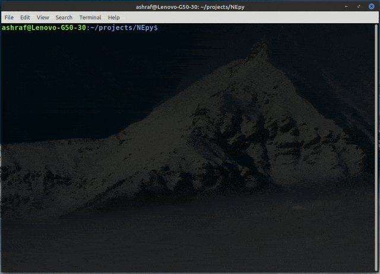

# A Python program to access a device via SSH & execute CLI commands remotely
This command-line Python program can connect to a network device via SSH and can remotely run any command on the device. The implementation on every vendor & type of devices might differ slighty depending on the CLI commands.
***

## PRE-REQUISITES

This command-line program requires python and paramiko

1. Python can be installed from its official site - www.python.org
2. `paramiko` can be installed via `pip3` using `pip3 install paramiko`

***

## FEATURES

This program has following features:

1. Take user input for device IP, username & password to connect via SSH
2. Connect to the mentioned device and use the session to run further commands
3. Take user input for further command to run
4. Execute the command the print the response on screen line by line

*** 
This is a barebone program having minimal functionality of just connecting to the device and executing a command. This program can be extended further in many ways to perform more complex workloads. For example instead of taking user input for IP & credentials, we can pass those information using either a list or a file and can perform SSH activity to a number of devices at once. We can also use other programs like [lan_scanner](https://github.com/sudoashraf/lan_scanner) or [wan_scanner](https://github.com/sudoashraf/wan_scanner) to provide list of devices to connect to. The implementation will ofcourse differ depending on the vendor & type of devices. 

***

## A Demo showing the remote access to a VyOS device

You can view the code [here](hello_device.py) and can leave a :star: if you like it. :smile:
